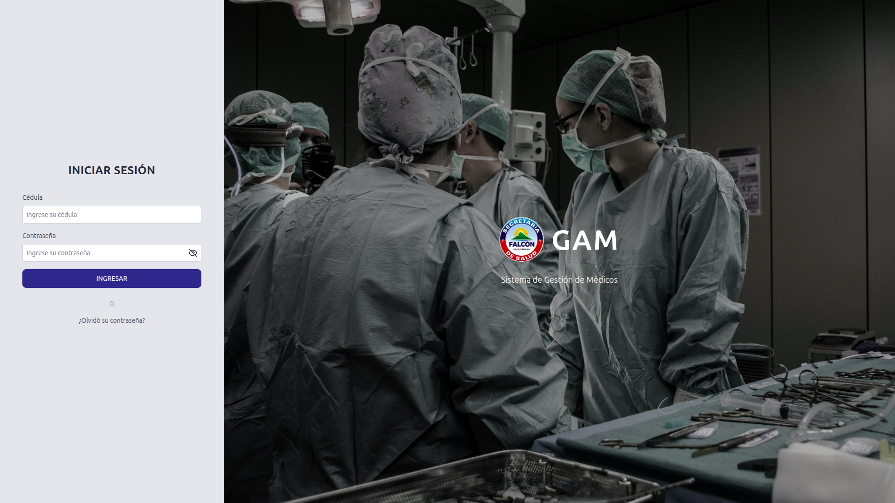

# GAM 

Sistema local para la Secretaria de Salud Falcon (Laravel + Blade + InertiaJs)

## Installation

Use the dependency manager [Composer](https://getcomposer.org/) to install Laravel.

```bash
git clone https://github.com/JDonquis/gam.git
```

```bash
cd gam
cp .env.example .env
composer install
```
Set values of MariaDB database on .env file and then:

```bash
php artisan migrate --seed
```

```bash
php artisan serve
```

Create a new terminal window and compile styles and js:

```bash
npm install
npm run build
```

## **Tools**  
- Laravel 12
- Blade
- Alpine JS  
- Tailwind CSS 


  

## **Get in touch**  
[juandonquis07@gmail.com](mailto:juandonquis07@email.com)

## License

Copyright (c) Secretaria de Salud. All rights reserved.
